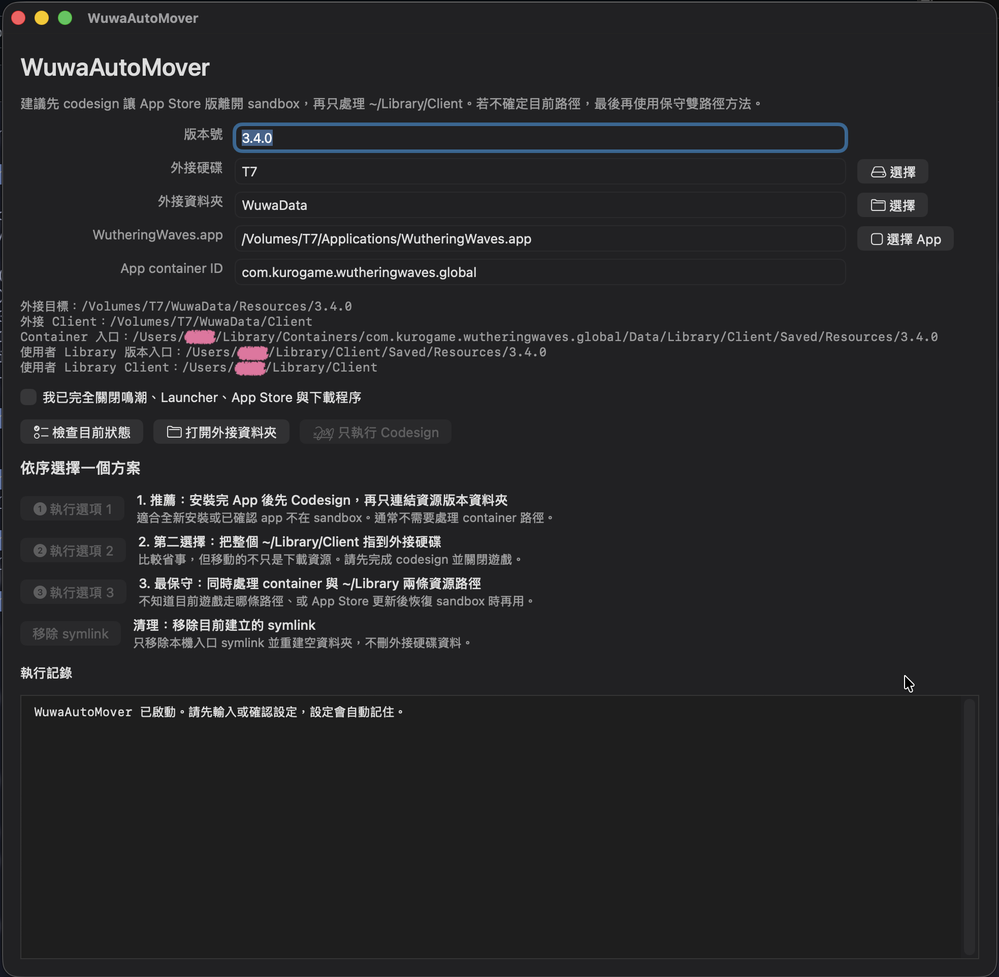

# WuwaAutoMover (Work in progress, not released yet)



WuwaAutoMover is a native macOS GUI app and command line tool for moving Wuthering Waves resource data to an external disk.

You can refer to this [repo](https://github.com/akalivaty/move_wuwa_to_extenal_disk_on_mac) and this tool will practice this process automatically.

It supports the three workflows described in the root README:

1. **Recommended**: codesign the App Store app first, then link only `~/Library/Client/Saved/Resources/<version>`.
2. **Second choice**: link the whole `~/Library/Client` folder to the external disk.
3. **Conservative fallback**: link both the sandbox container resource path and the `~/Library/Client` resource path.

Settings are saved after you enter them, so you do not need to retype your volume and paths every time.

## Install

### GUI App With Homebrew Cask

After publishing the cask to a tap:

```shell
brew tap akalivaty/homebrew-apps
brew install --cask wuwa-auto-mover
```

For local testing from this repository:

```shell
brew install --cask ./packaging/homebrew/wuwa-auto-mover-cask.rb
```

The cask installs:

- `WuwaAutoMover.app`
- `wuwa-auto-mover` CLI symlink from the app bundle

### CLI With Homebrew Formula

After publishing the formula to a tap:

```shell
brew tap akalivaty/homebrew-apps
brew install wuwa-auto-mover
```

For local testing from this repository:

```shell
brew install ./packaging/homebrew/wuwa-auto-mover.rb
```

### Build From Source

From `WuwaAutoMover/`:

```shell
swift build -c release
```

From the repo root, to package both outputs:

```shell
./WuwaAutoMover/scripts/build_wuwa_auto_mover.sh
```

Outputs:

- `WuwaAutoMover/build/WuwaAutoMover.app`
- `WuwaAutoMover/build/wuwa-auto-mover`

Open the GUI:

```shell
open WuwaAutoMover/build/WuwaAutoMover.app
```

## GUI Usage

Fill in your own values. The text shown in the fields is only a placeholder example, not a default.

Required settings:

- Resource version, for example `3.4.0`
- External volume name under `/Volumes`, for example `T7`
- External root folder under that volume, for example `WuwaData`
- App container ID, for example `com.kurogame.wutheringwaves.global`
- Absolute path to `WutheringWaves.app`, for example `/Volumes/T7/Applications/WutheringWaves.app`

The GUI has three main actions:

- `1 推薦：Codesign + 連結版本`
- `2 整個 Client symlink`
- `3 保守雙路徑`

Before running any action that changes files, fully close Wuthering Waves, Launcher, App Store, and active downloader processes, then tick the confirmation checkbox.

## CLI Usage

Show help:

```shell
wuwa-auto-mover --help
```

Save settings first:

```shell
wuwa-auto-mover config \
  --version 3.4.0 \
  --volume T7 \
  --external-root WuwaData \
  --container-id com.kurogame.wutheringwaves.global \
  --app-path "/Volumes/T7/Applications/WutheringWaves.app"
```

These examples are placeholders. Use your own volume name and paths.

Saved settings are stored at:

```text
~/Library/Application Support/WuwaAutoMover/config.json
```

After settings are saved, later commands can omit those options unless you want to override them.

### Option 1: Recommended

Codesign the app, then link only:

```text
~/Library/Client/Saved/Resources/<version>
```

Run:

```shell
wuwa-auto-mover recommended --yes --admin
```

Use `--admin` if codesign needs a macOS administrator prompt.

### Option 2: Whole Client Symlink

Link the whole `~/Library/Client` folder:

```shell
wuwa-auto-mover link-client --yes
```

This is convenient after the app has been re-signed and is no longer sandboxed, but it moves more than just downloaded resources.

### Option 3: Conservative Fallback

Link both possible resource version paths:

```shell
wuwa-auto-mover fallback-link --yes
```

Use this if the app still has the sandbox entitlement, you already launched the game before codesigning, or you are unsure which path the game is currently using.

### Other Commands

Check current paths:

```shell
wuwa-auto-mover status
```

Only codesign the app:

```shell
wuwa-auto-mover codesign --admin
```

Inspect app entitlements:

```shell
wuwa-auto-mover entitlements
```

Remove symlinks without deleting external data:

```shell
wuwa-auto-mover unlink --yes
```

## CLI Options

- `--version <value>`: resource version, for example `3.4.0`
- `--volume <name>`: external volume name under `/Volumes`, for example `T7`
- `--external-root <path>`: folder under the external volume, for example `WuwaData`
- `--container-id <id>`: App Store container ID, for example `com.kurogame.wutheringwaves.global`
- `--app-path <path>`: absolute path to `WutheringWaves.app`
- `--yes`: required for operations that change local symlinks or folders
- `--admin`: use macOS administrator prompt for codesign

Options passed to any command override saved settings and are saved for future runs.

## Release Automation

This repository includes a GitHub Actions workflow at:

```text
.github/workflows/release.yml
```

After adding the `HOMEBREW_TAP_TOKEN` repository secret, the release flow is:

1. Commit and push your WuwaAutoMover changes.
2. Create and push a version tag, for example `v1.0.0`.
3. GitHub Actions builds `WuwaAutoMover.app` and the CLI on `macos-latest`.
4. The workflow zips `WuwaAutoMover.app` as `WuwaAutoMover-<version>.zip`.
5. The workflow creates or updates the GitHub Release for that tag.
6. The workflow calculates SHA256 for the app zip and source tarball.
7. The workflow checks out `akalivaty/homebrew-apps`.
8. The workflow updates:
   - `Casks/wuwa-auto-mover.rb`
   - `Formula/wuwa-auto-mover.rb`
9. The workflow commits and pushes the tap update.

Create a release:

```shell
git tag v1.0.0
git push origin v1.0.0
```

The tag name must start with `v`. The Homebrew version will be the tag without `v`, so `v1.0.0` becomes `version "1.0.0"`.

The tap repository must allow the token stored in `HOMEBREW_TAP_TOKEN` to push to `akalivaty/homebrew-apps`.

Expected tap paths:

```text
homebrew-apps/
├── Casks/
│   └── wuwa-auto-mover.rb
└── Formula/
    └── wuwa-auto-mover.rb
```

If either file does not exist yet, the workflow copies the template from `packaging/homebrew/` and then updates it.

## Homebrew Templates

Templates are under `packaging/homebrew/`:

- `wuwa-auto-mover.rb`: formula for the CLI
- `wuwa-auto-mover-cask.rb`: cask for `WuwaAutoMover.app`, including the `wuwa-auto-mover` binary symlink from the app bundle

The workflow replaces the placeholder `sha256` values during release.
