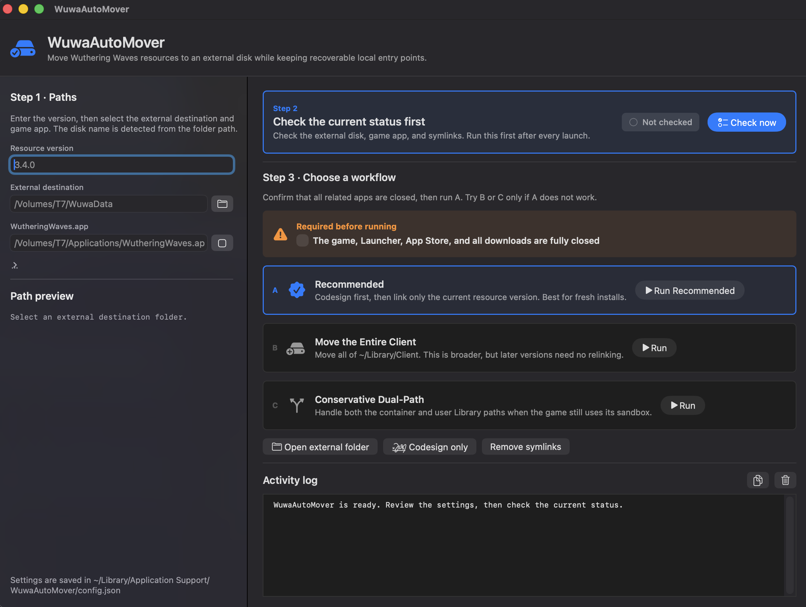

# WuwaAutoMover

**English** (translated with gpt 5.6 Sol) | [繁體中文](README.zh-TW.md)

WuwaAutoMover is a native macOS GUI app that moves Wuthering Waves resources to an external disk while keeping recoverable symbolic links at the original locations.

> [!note]
> After changing the target resource path using WuwaAutoMover, the built-in disk still needs enough space for the game pre-check (approximately 80 GB). Once the check is passed, the download will begin to the specified external disk.
>
> Each major version requires repeating the process, e.g., 3.3, 3.4, 3.5. Fixes between major versions do not require it.
>
> For more details, please refer to [Move Wuthering Waves to an External Disk on macOS](https://github.com/akalivaty/move_wuwa_to_extenal_disk_on_mac)

## User Guide

### Download and Install

1. Open [GitHub Releases](https://github.com/akalivaty/WuwaAutoMover/releases/latest) and download the latest `WuwaAutoMover-<version>.dmg`.
2. Open the DMG.
3. Drag `WuwaAutoMover.app` onto the `Applications` shortcut inside the DMG.
4. Launch WuwaAutoMover from the macOS Applications folder.

Only download the app from this project's GitHub Releases page.

### Approve the App on First Launch

This project does not use a paid Apple Developer certificate. The app is ad-hoc signed and is not notarized, so macOS may block it the first time it is opened:


This warning does not mean that the app bundle is damaged. Follow these steps:

1. Select `Done` in the warning. Do not move the app to the Trash.
2. Open macOS `System Settings`.
3. Select `Privacy & Security`.
4. Scroll down to Security and find the message that WuwaAutoMover was blocked.
5. Select `Open Anyway`.
6. Confirm with Touch ID or an administrator password, then select `Open` once more.

You can also Control-click WuwaAutoMover in the Applications folder and select `Open`. If macOS still blocks it, approve the app from Privacy & Security using the steps above.

### Interface Preview

On the first launch, choose English or Traditional Chinese. WuwaAutoMover saves the selection for future launches.



### How to Use WuwaAutoMover

Text displayed in empty fields is an example of the expected format, not a saved default. Enter your own version and paths.

#### Step 1: Configure Paths

Enter or select:

- `Resource version`, for example `3.5.0`.
- `External destination`, for example `/Volumes/T7/WuwaData`. WuwaAutoMover detects the external volume from the selected folder.
- `WutheringWaves.app`, using its absolute path, for example `/Volumes/T7/Applications/WutheringWaves.app`.
- `App Container ID`, for example `com.kurogame.wutheringwaves.global`.

Selected paths are written into the fields immediately. Settings are saved automatically, so they do not need to be entered again on every launch.

#### Step 2: Check the Current Status

After every launch, select `Check now` before running a workflow. WuwaAutoMover checks:

- The external volume and destination folder.
- The game app path.
- Existing symbolic links.
- Other resource versions and `Video` entries under both local `Resources` paths.

If resources other than the current version are found, WuwaAutoMover displays a confirmation dialog first. If deletion is approved, it removes the listed versions, `Video`, symbolic links, and the actual data targeted by those links inside the configured external `Resources` folder. Confirm that none of the listed files need to be kept before continuing.

#### Step 3: Close Related Apps and Run a Workflow

1. Completely quit Wuthering Waves, Launcher, and all download processes.
2. Select the shutdown confirmation checkbox in WuwaAutoMover.
3. Run the blue-highlighted `Recommended` workflow first.

The recommended workflow codesigns the game app before linking only the current resource version. Codesigning can take several minutes. Keep WuwaAutoMover open and do not disconnect the external disk while it is running.

Available workflows:

1. **A - Recommended**: Codesign first, then link only the current resource version. Use this for fresh installations and normal cases.
2. **B - Move the Entire Client (unstable)**: Move all of `~/Library/Client`. This has a broader scope, but later game versions usually do not need to be linked again.
3. **C - Conservative Dual-Path**: Handle both the sandbox container and user Library paths. Use this only when the game still accesses its sandbox path.

Workflows B and C are fallbacks when workflow A does not work. If a prerequisite has not been completed, selecting a workflow shows the missing step.

Once wuwa is launched, it checks that the built-in disk has enough space and then starts downloading resources to the external disk. The final result is shown below.


### Activity Log and Quitting

- Results appear in the Activity Log. Text can be selected directly or copied with the copy button.
- Press `Command-Q` or select the red window close button to quit WuwaAutoMover.
- If an operation is still running, the app asks for confirmation before quitting to avoid interrupting a file move or codesign operation.

Settings are stored at:

```text
~/Library/Application Support/WuwaAutoMover/config.json
```

### Automatic Updates

WuwaAutoMover uses Sparkle 2:

- It checks for updates automatically once per day.
- Signed updates are downloaded and installed automatically by default.
- Select `WuwaAutoMover` > `Check for Updates...` to check manually.
- Update DMGs and the appcast are verified with the project's Sparkle EdDSA public key.

If an update requests a relaunch while a file operation is running, the existing quit confirmation prevents the operation from being interrupted accidentally.

---

## Developer Documentation

### Technology and Project Structure

- Swift 6 and Swift Package Manager
- AppKit GUI
- macOS 13+
- Sparkle 2 automatic updates
- GitHub Actions release automation
- GUI only, with no CLI or Homebrew package

Main directories:

```text
Sources/WuwaAutoMoverCore/       Move, validation, codesign, and symbolic-link logic
Sources/WuwaAutoMoverGUI/        AppKit GUI, localization, and window control
Tests/WuwaAutoMoverCoreTests/    Core unit tests
packaging/dmg/                   Installation notes bundled in the DMG
scripts/                         App and DMG build scripts
.github/workflows/release.yml    GitHub Release workflow
```

### Tests

From the `WuwaAutoMover/` directory, run:

```shell
swift test
```

Tests cover the codesign command, safe stale-resource deletion, deletion boundaries for symbolic-link targets, and localized validation errors.

### Build the App and DMG

For a standard Swift release build:

```shell
swift build -c release
```

Build the distributable `.app` bundle:

```shell
./scripts/build_wuwa_auto_mover.sh
```

The build script:

1. Builds the `WuwaAutoMoverGUI` release product.
2. Creates a standard `.app` bundle.
3. Copies `Sparkle.framework` into `Contents/Frameworks`.
4. Applies an ad-hoc code signature and verifies the bundle.
5. Removes `.build/release` and its underlying SwiftPM release directory after a successful build.

Output:

```text
build/WuwaAutoMover.app
```

Then create the DMG:

```shell
./scripts/create_dmg.sh
```

The DMG script reads only `build/WuwaAutoMover.app`, so it can run immediately after the build script removes the SwiftPM release artifacts. It uses `ditto` to preserve the complete app bundle, adds an `/Applications` shortcut and installation notes, and uses `hdiutil` to create and verify the compressed DMG.

Output:

```text
build/WuwaAutoMover-<version>.dmg
```

Optionally provide an explicit app version and build number:

```shell
WUWA_VERSION=1.0.1 WUWA_BUILD_NUMBER=2 \
  ./scripts/build_wuwa_auto_mover.sh
./scripts/create_dmg.sh 1.0.1
```