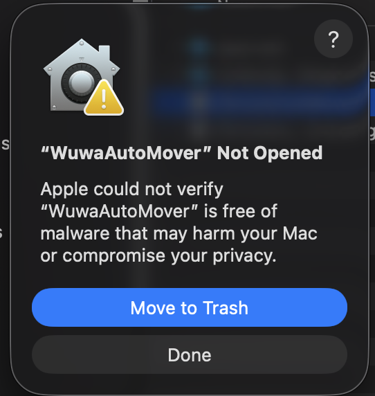
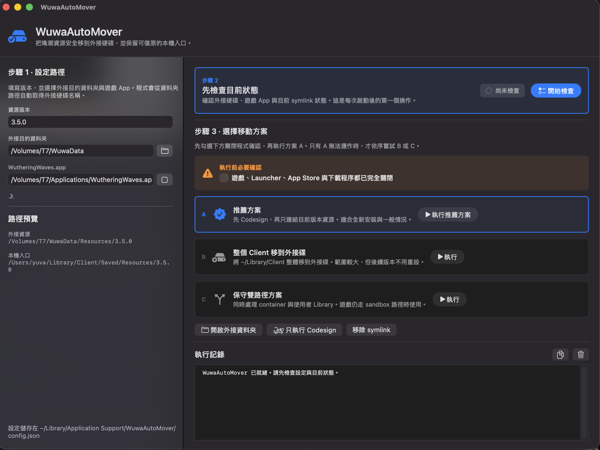
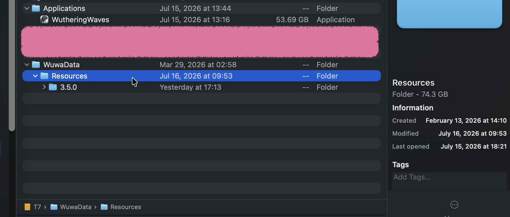

# WuwaAutoMover

[English](README.md) | **繁體中文**

WuwaAutoMover 是一個原生 macOS GUI App，用來將《鳴潮》資源安全移動到外接硬碟，並在原路徑建立可復原的 symbolic link。

> [!note]
> 使用 WuwaAutoMover 變更路徑後，內建硬碟依然需要足夠的空間以供遊戲預先檢查 (大約 80 GB)，一旦通過檢查就會開始下載到指定的外接硬碟路徑。
>
> 每次大版本都要重新做一次 e.g. 3.3、3.4、3.5，大版本之間的 fix 不需要。
>
> 相關細節可以參考 [Move Wuthering Waves to an External Disk on macOS](https://github.com/akalivaty/move_wuwa_to_extenal_disk_on_mac)

## 使用者指南

### 下載與安裝

1. 前往 [GitHub Releases](https://github.com/akalivaty/WuwaAutoMover/releases/latest) 下載最新版 `WuwaAutoMover-<version>.dmg`。
2. 打開 DMG。
3. 將 `WuwaAutoMover.app` 拖到 DMG 內的 `Applications` 捷徑。
4. 從 macOS「應用程式」資料夾開啟 WuwaAutoMover。

### 第一次開啟時允許執行

本專案沒有使用付費 Apple Developer 憑證，因此 App 採用 ad-hoc signing，且未經 Apple Notarization。第一次開啟時，macOS 可能會阻止執行並顯示以下訊息：



這不是 App 損壞。請依序操作：

1. 在警告視窗按下 `完成` / `Done`，不要選擇移到垃圾桶。
2. 開啟 macOS `系統設定` / `System Settings`。
3. 進入 `隱私權與安全性` / `Privacy & Security`。
4. 向下捲動到「安全性」，找到 WuwaAutoMover 被阻擋的訊息。
5. 按下 `仍要打開` / `Open Anyway`。
6. 使用 Touch ID 或管理員密碼確認，再按一次 `打開` / `Open`。

也可以先在 Finder 的「應用程式」中對 WuwaAutoMover 按住 Control 點擊，選擇 `打開`；若仍被阻擋，再使用上面的「隱私權與安全性」步驟核准。

### 介面預覽

第一次啟動時可以選擇繁體中文或英文，之後仍會使用已儲存的語言設定。



### 使用步驟

欄位中的文字只是格式範例，不是實際預設值。請填入自己的版本與路徑。

#### 步驟 1：設定路徑

填寫或選擇：

- `資源版本`：例如 `3.5.0`。
- `外接目的資料夾`：例如 `/Volumes/T7/WuwaData`。選擇資料夾後，App 會自動取得外接硬碟名稱。
- `WutheringWaves.app`：遊戲 App 的絕對路徑，例如 `/Volumes/T7/Applications/WutheringWaves.app`。

選擇的路徑會立即寫入欄位，設定也會自動儲存，不需要每次重新輸入。

#### 步驟 2：開始檢查

每次啟動 WuwaAutoMover 後，先按下 `開始檢查` / `Check now`。App 會檢查：

- 外接硬碟與目的資料夾。
- 遊戲 App 路徑。
- 目前 symbolic link 狀態。
- 兩個本機 `Resources` 路徑中是否殘留其他版本或 `Video`。

若發現目前版本以外的資源，App 會先顯示確認視窗。選擇刪除後，會刪除列出的版本、`Video`、symbolic link，以及 symbolic link 在已設定之外接 `Resources` 資料夾內所指向的實際資料。請先確認其中沒有需要保留的檔案。

#### 步驟 3：關閉相關程式並執行

1. 完全關閉《鳴潮》、Launcher 與所有下載程序。
2. 勾選畫面中的關閉確認 checkbox。
3. 優先執行藍框標示的 `推薦方案`。

推薦方案會先對遊戲 App 執行 codesign，再只連結目前版本的資源。Codesign 可能需要數分鐘；執行期間會顯示進度訊息，請不要關閉 WuwaAutoMover 或拔除外接硬碟。

三種方案的用途：

1. **推薦方案 A**：先 codesign，再只連結目前版本資源。適合全新安裝與一般情況。
2. **整個 Client 移到外接碟 B (不穩定)**：移動完整的 `~/Library/Client`。影響範圍較大，但後續版本通常不需要重新連結。
3. **保守雙路徑方案 C**：同時處理 sandbox container 與使用者 Library 路徑。只在遊戲仍使用 sandbox 路徑時採用。

方案 B、C 是推薦方案 A 無法正常運作時的備用方案。若必要條件尚未完成，點擊按鈕會顯示缺少的步驟。

設定儲存在：

```text
~/Library/Application Support/WuwaAutoMover/config.json
```

可以使用以下指令重新指定界面語言：

```shell
defaults delete dev.yuva.WuwaAutoMover interfaceLanguage
```

一旦進入遊戲，將會檢查內建硬碟空間是否足夠，然後開始下載資源到外接磁碟。最後結果如下圖。



### 自動更新

WuwaAutoMover 使用 Sparkle 2：

- 每天自動檢查一次更新。
- 預設會自動下載並安裝已簽章的更新。
- 可從 App 選單選擇 `檢查更新...` / `Check for Updates...` 手動檢查。
- 更新 DMG 與 appcast 都會使用專案的 Sparkle EdDSA 公鑰驗證。

如果更新需要重新啟動 App，但此時仍有檔案操作正在執行，原本的結束確認機制仍會阻止意外中斷。

---

## 開發者文件

### 技術與專案結構

- Swift 6 / Swift Package Manager
- AppKit GUI
- macOS 13+
- Sparkle 2 自動更新
- GitHub Actions Release automation
- GUI-only，沒有 CLI 與 Homebrew package

主要目錄：

```text
Sources/WuwaAutoMoverCore/       搬移、檢查、codesign 與 symbolic link 邏輯
Sources/WuwaAutoMoverGUI/        AppKit GUI、語言與視窗控制
Tests/WuwaAutoMoverCoreTests/    Core 單元測試
packaging/dmg/                   DMG 內附的安裝說明
scripts/                         App 與 DMG build scripts
.github/workflows/release.yml    GitHub Release workflow
```

### 測試

從 `WuwaAutoMover/` 執行：

```shell
swift test
```

測試涵蓋 codesign 命令、安全刪除舊資源、symlink 實際目標刪除界線與雙語錯誤訊息。

### Build App 與 DMG

一般 Swift release build：

```shell
swift build -c release
```

建立可發佈的 `.app`：

```shell
./scripts/build_wuwa_auto_mover.sh
```

build script 會：

1. 編譯 `WuwaAutoMoverGUI` release product。
2. 建立標準 `.app` bundle。
3. 將 `Sparkle.framework` 複製到 `Contents/Frameworks`。
4. 執行 ad-hoc codesign 並驗證 bundle。
5. 成功後刪除 `.build/release` 及其對應的 SwiftPM release 目錄。

輸出：

```text
build/WuwaAutoMover.app
```

接著建立 DMG：

```shell
./scripts/create_dmg.sh
```

DMG script 只讀取 `build/WuwaAutoMover.app`，因此可以在 build script 清除 SwiftPM release 產物後立刻執行。它使用 `ditto` 保留完整 App bundle，加入指向 `/Applications` 的捷徑與安裝說明，再使用 `hdiutil` 建立及驗證壓縮 DMG。

輸出：

```text
build/WuwaAutoMover-<version>.dmg
```

可選擇指定 build 版本：

```shell
WUWA_VERSION=1.0.1 WUWA_BUILD_NUMBER=2 \
  ./scripts/build_wuwa_auto_mover.sh
./scripts/create_dmg.sh 1.0.1
```